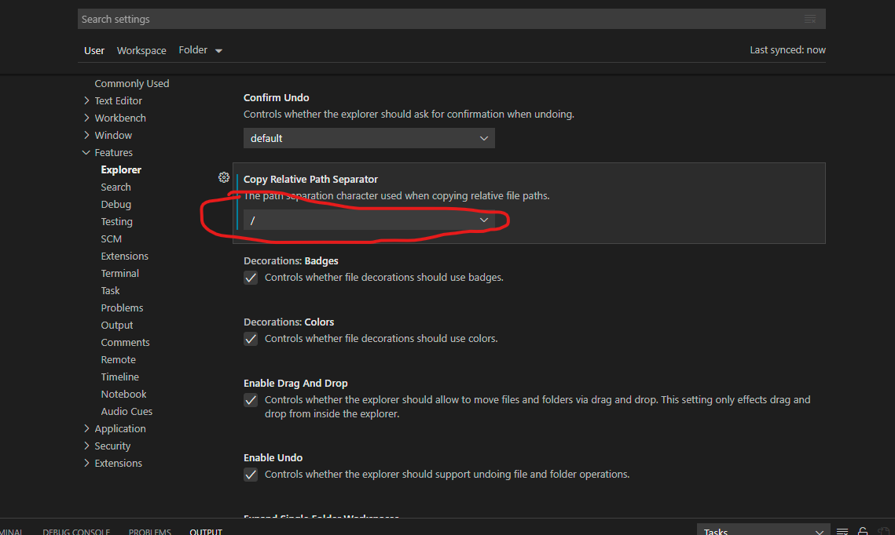

1. 工作区间（workspace）:同时打开多个项目

```shell
{
	"folders": [
		{
			"path": "..\\IDE\\idea-projects\\vue-element-admin"
		},
		{
			"path": "..\\IDE\\idea-projects\\python\\learn-python3-master"
		},
		{
			"path": "..\\IDE\\idea-projects\\python\\Python"
		}
	],
	"settings": {}
}
```
2. 复制相对路径时，斜杠设置为/
settings->Features->Explorer中的`Copy Relative Path Separator`设置为/。
